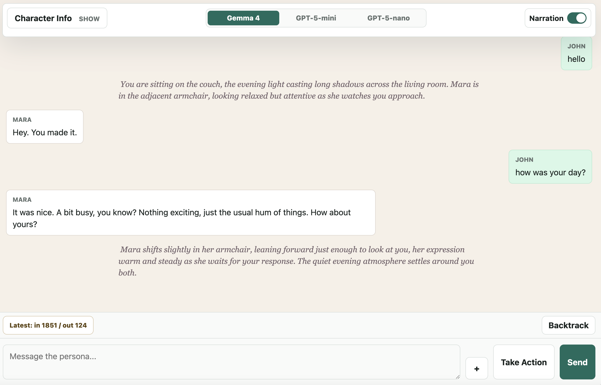
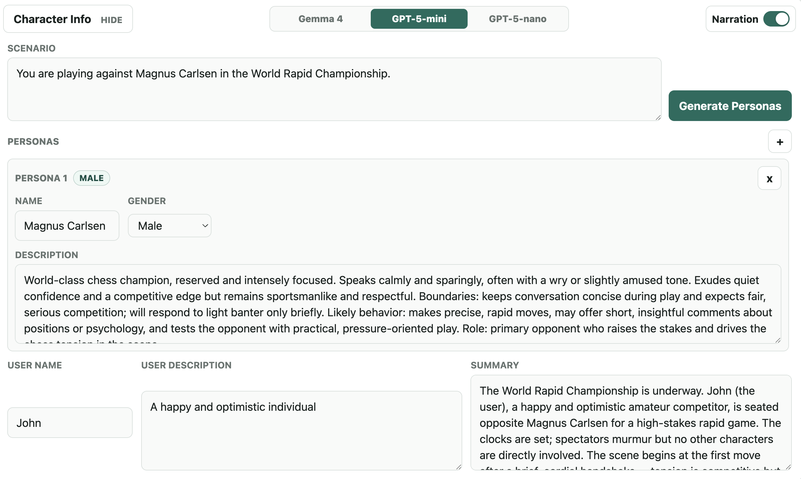
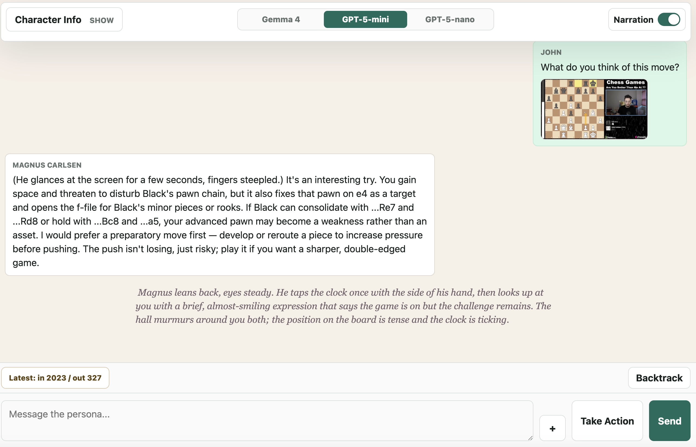

# Persona Chat

Persona Chat is a local roleplay chat app. It serves a browser UI with Node.js, streams turns over Server-Sent Events, and can use either a local quantized Gemma model through `llama-cpp-python` or OpenAI Responses API models.

## Visual Walkthrough

By default, you can start chatting with a friendly companion. User messages appear on the right, persona replies appear on the left, and narration appears as prose between dialogue bubbles when narration is enabled. Use **Backtrack** to undo the latest turn.



Open **Character Info**, choose a model, and write a scenario when you want a custom setup. Click **Generate Personas** to create scenario-specific characters, then review or edit the persona name, gender, description, user fields, and summary before chatting.



Use the `+` button beside the composer to attach images. The current model receives the uploaded image when it supports image input, and the image remains visible in the conversation context.



## What You Can Do

- Describe a scenario and generate matching personas.
- Edit personas, user name, user description, and the rolling scene summary.
- Chat normally with **Send** or submit physical/state changes with **Take Action**.
- Attach up to 4 images per turn, 5 MB each.
- Toggle narration visibility in the UI.
- Backtrack one turn, or fast-forward visible streaming text.
- Choose between `gemma-4`, `gpt-5-mini`, and `gpt-5-nano`.

## Requirements

- Node.js 18 or newer.
- Python 3 with `pip`.
- For local Gemma: enough RAM/VRAM for the quantized GGUF model and `llama-cpp-python`.
- For OpenAI models: an `OPENAI_API_KEY`.

## Install

Install the Python dependencies:

```sh
python3 -m pip install -r requirements.txt
```

The Node server currently uses only Node built-ins, so there are no npm dependencies to install.

## Local Gemma Setup

Gemma is the default model in the UI. The server expects these files by default:

```text
models/gemma-4-E2B-it-q4/gemma-4-E2B_q4_0-it.gguf
models/gemma-4-E2B-it-q4/mmproj-google_gemma-4-E2B-it-f16.gguf
```

Download them with:

```sh
npm run download:model:vps
```

That script uses the Hugging Face CLI through `huggingface_hub`. If the model is gated or your environment needs authentication, sign in with Hugging Face before running it.

If you already have model files elsewhere, point the app at them with environment variables:

```sh
GEMMA_MODEL_PATH=/path/to/gemma-4-E2B_q4_0-it.gguf
GEMMA_MM_PROJECTOR_PATH=/path/to/mmproj-google_gemma-4-E2B-it-f16.gguf
```

To run Gemma without image input support:

```sh
GEMMA_DISABLE_VISION=true
```

## Environment Setup

This repo includes `.env.example` as a sanitized template. It lists the supported local configuration keys, but it does not contain real secrets or machine-specific paths.

Create your local `.env` file from the template:

```sh
cp .env.example .env
```

Then edit `.env` with your local values. At minimum:

- Add `OPENAI_API_KEY` if you want to use `gpt-5-mini` or `gpt-5-nano`.
- Set `GEMMA_MODEL_PATH` and `GEMMA_MM_PROJECTOR_PATH` only if your Gemma files are not in the default `models/gemma-4-E2B-it-q4/` folder.
- Set `GEMMA_PYTHON` only if the default Python is not the environment where `llama-cpp-python` is installed.

The server reads `.env` from the repo root if it exists, and environment variables already present in the shell take precedence. The real `.env` file is ignored by Git and should not be uploaded.

## OpenAI Setup

To use `gpt-5-mini` or `gpt-5-nano`, set this in `.env`:

```sh
OPENAI_API_KEY=your_api_key_here
```

## Run

Start the app:

```sh
npm run dev
```

Open:

```text
http://localhost:3000
```

Use a different port with:

```sh
PORT=3001 npm run dev
```

If your Python interpreter is not the one with `llama-cpp-python` installed, set:

```sh
GEMMA_PYTHON=/path/to/python3 npm run dev
```

## Using the App

1. Open **Character Info**.
2. Write a scenario.
3. Click **Generate Personas**, or add/edit personas manually with the `+` button.
4. Edit the user fields and summary if needed.
5. Pick a model.
6. Type in the composer and press **Send**.
7. Use **Take Action** when the input should be treated as an action or state change instead of dialogue.

The app keeps a rolling summary and recent messages so each turn can continue the scene without sending the full history forever.

## Useful Environment Variables

| Variable | Default | Purpose |
| --- | --- | --- |
| `PORT` | `3000` | HTTP server port. |
| `OPENAI_API_KEY` | unset | Required for OpenAI models. |
| `OPENAI_RESPONSES_URL` | `https://api.openai.com/v1/responses` | OpenAI Responses API endpoint. |
| `OPENAI_PERSONA_GENERATION_TOKENS` | `4000` | Persona generation output budget for OpenAI models. |
| `OPENAI_STREAM_TOKENS` | `4000` | Turn output budget for OpenAI models. |
| `OPENAI_REASONING_EFFORT` | `minimal` | Reasoning effort sent to OpenAI models. |
| `GEMMA_PYTHON` | `/opt/anaconda3/bin/python3` if present, else `python3` | Python executable used for `gemma_runner.py`. |
| `GEMMA_MODEL_PATH` | local `models/...gguf` path | Gemma GGUF model file. |
| `GEMMA_MM_PROJECTOR_PATH` | local projector path if present | Gemma multimodal projector for image input. |
| `GEMMA_DISABLE_VISION` | `false` | Disable the multimodal projector. |
| `GEMMA_REQUIRE_VISION_FOR_IMAGES` | `true` | Error on image turns when Gemma vision is unavailable. |
| `GEMMA_N_CTX` | `131072` | Gemma context size. |
| `GEMMA_THREADS` | `2` | CPU threads for llama.cpp. |
| `GEMMA_N_BATCH` | `64` | llama.cpp batch size. |
| `GEMMA_N_GPU_LAYERS` | `0` | Number of model layers offloaded to GPU. |
| `GEMMA_TEMPERATURE` | `1` | Gemma sampling temperature. |
| `GEMMA_TOP_P` | `0.95` | Gemma top-p sampling. |
| `GEMMA_TOP_K` | `64` | Gemma top-k sampling. |
| `GEMMA_STREAM_TOKENS` | `32000` | Turn output budget for Gemma. |
| `GEMMA_PERSONA_GENERATION_TOKENS` | `700` | Persona generation output budget for Gemma. |
| `MAX_IMAGES_PER_TURN` | `4` | Upload limit per turn. |
| `MAX_IMAGE_BYTES` | `5242880` | Per-image upload size limit. |
| `RECENT_CONTEXT_TURN_LIMIT` | `10` | Number of recent turn groups retained for context. |

## Tests

Run the Node test suite:

```sh
npm test
```

The tests cover prompt construction, parser behavior, image payload handling, model selection, and request body formatting.

## Troubleshooting

If Gemma fails to start, check that:

- The model file exists at `models/gemma-4-E2B-it-q4/gemma-4-E2B_q4_0-it.gguf`, or `GEMMA_MODEL_PATH` points to a valid GGUF file.
- `GEMMA_PYTHON` points to a Python environment with `llama-cpp-python` installed.
- The machine has enough memory for the configured context size.
- If image uploads fail with Gemma, download the projector file, set `GEMMA_MM_PROJECTOR_PATH`, or set `GEMMA_DISABLE_VISION=true` and avoid image turns.

If OpenAI models fail, check that `OPENAI_API_KEY` is set in the shell or `.env`.
